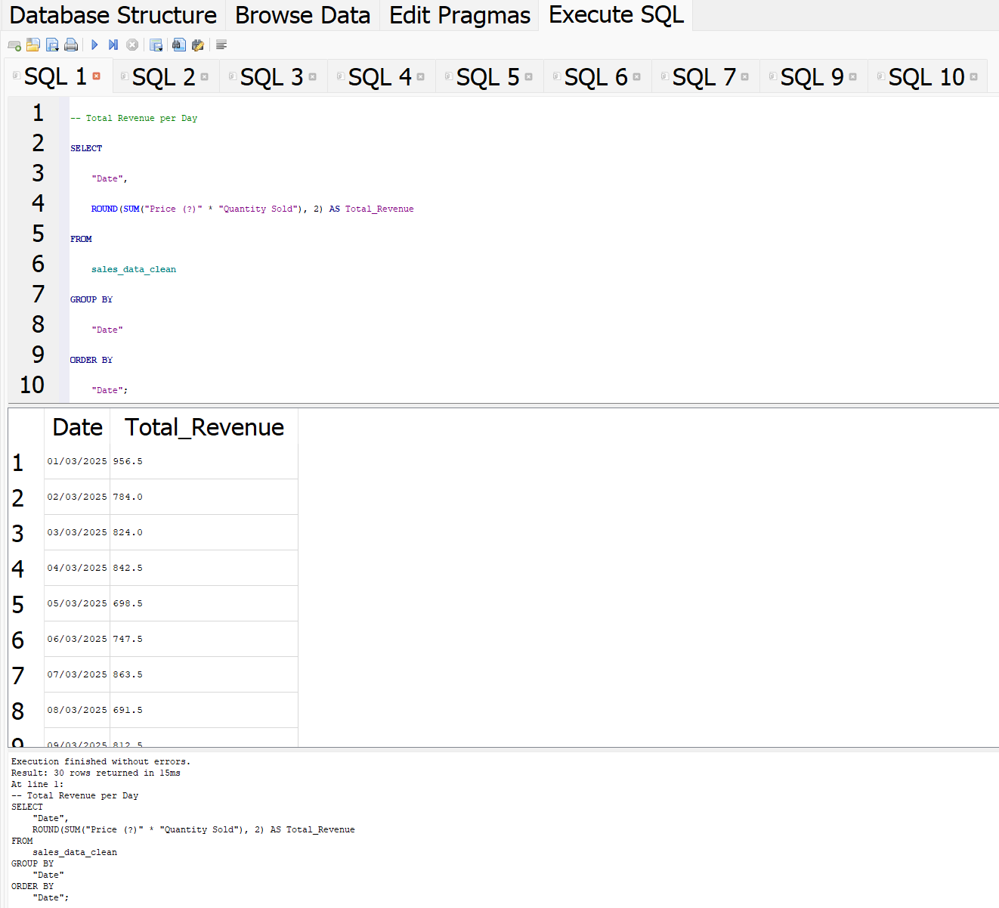
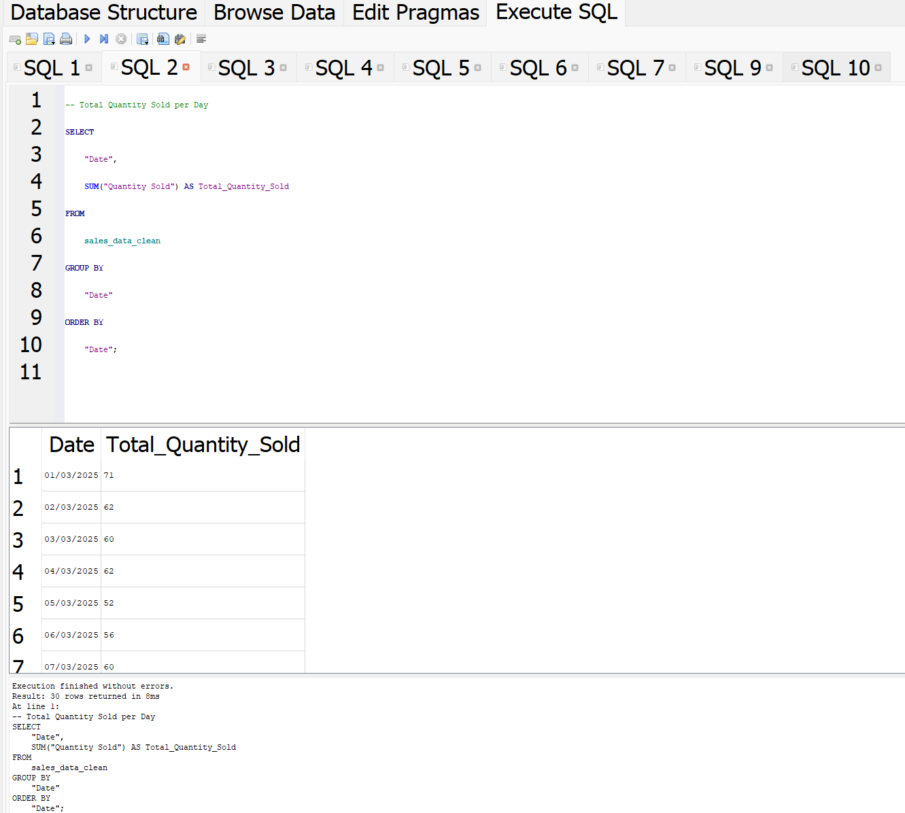
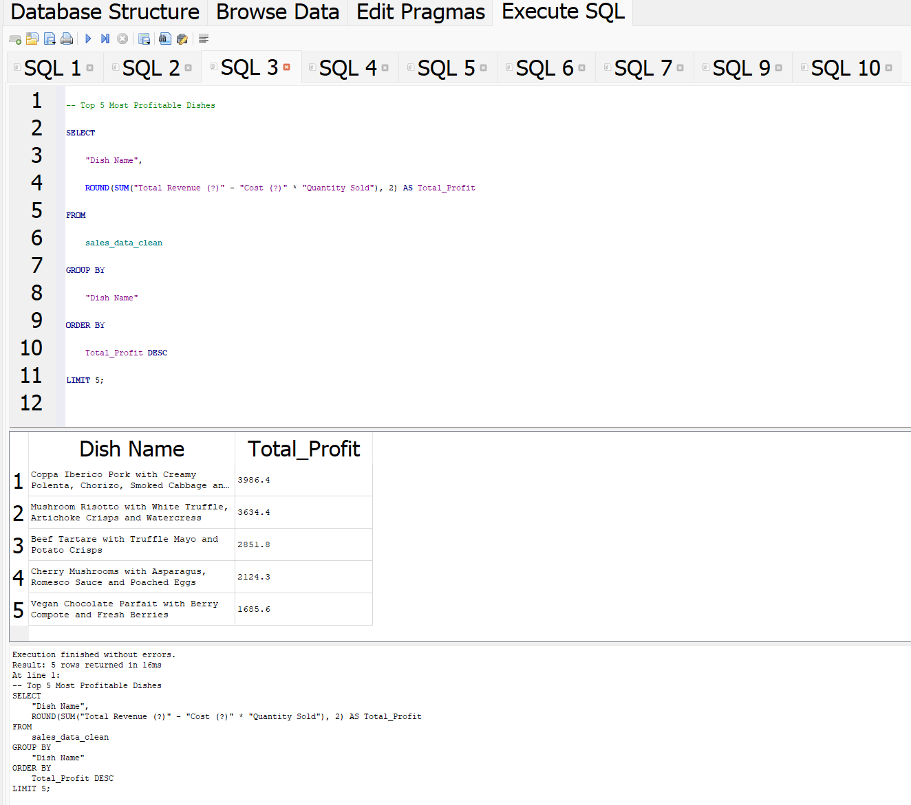
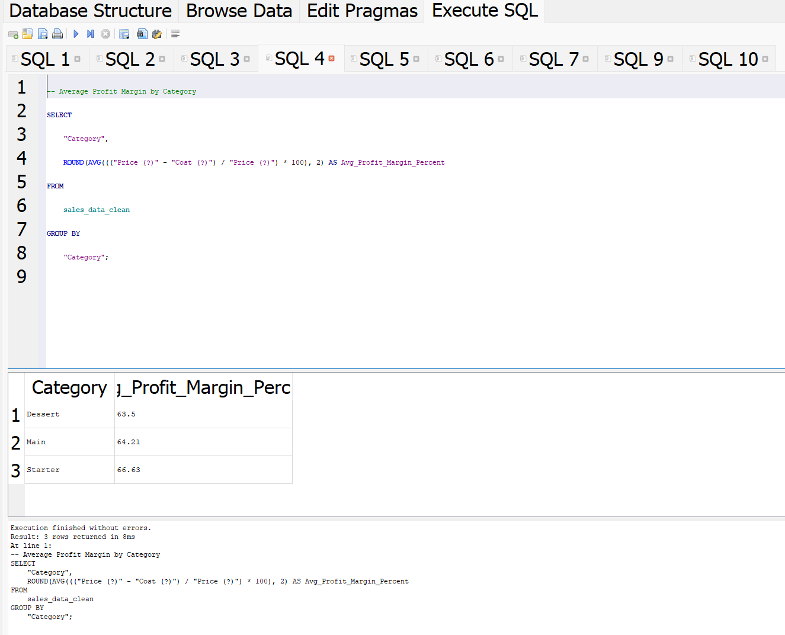
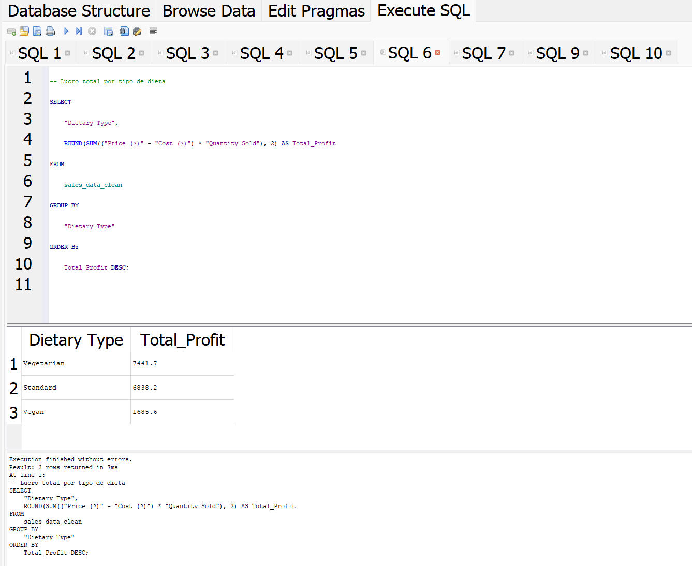
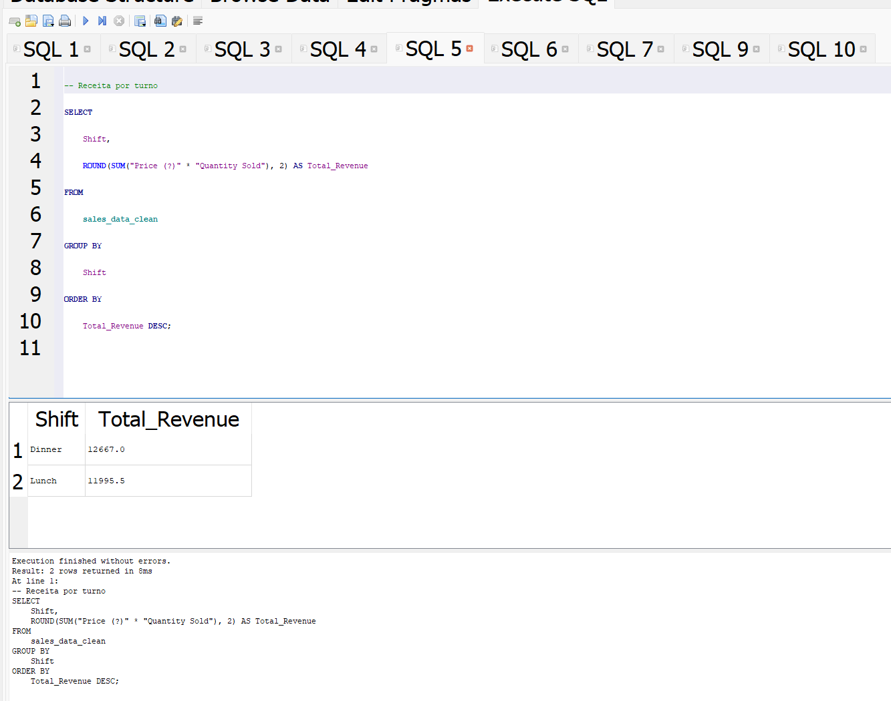
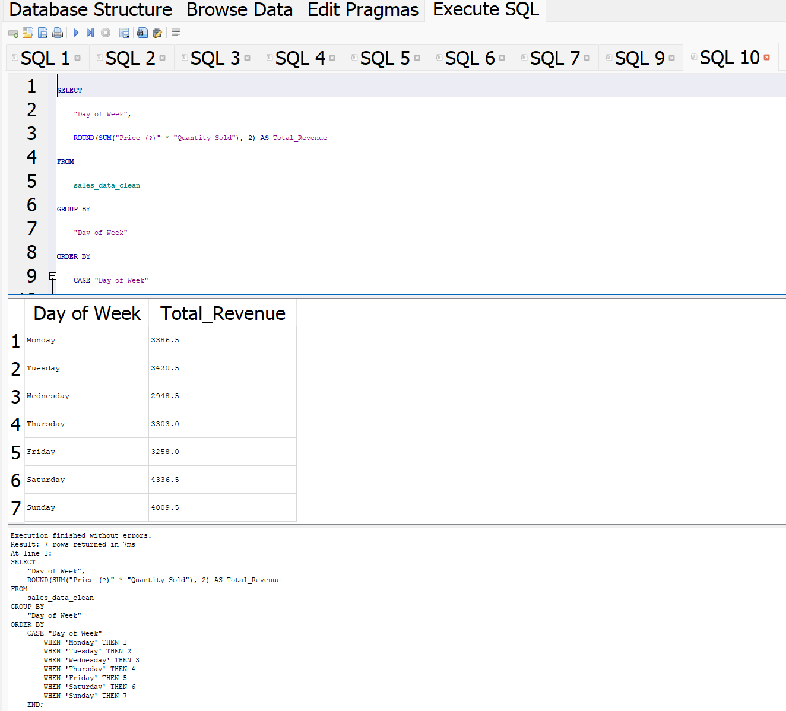
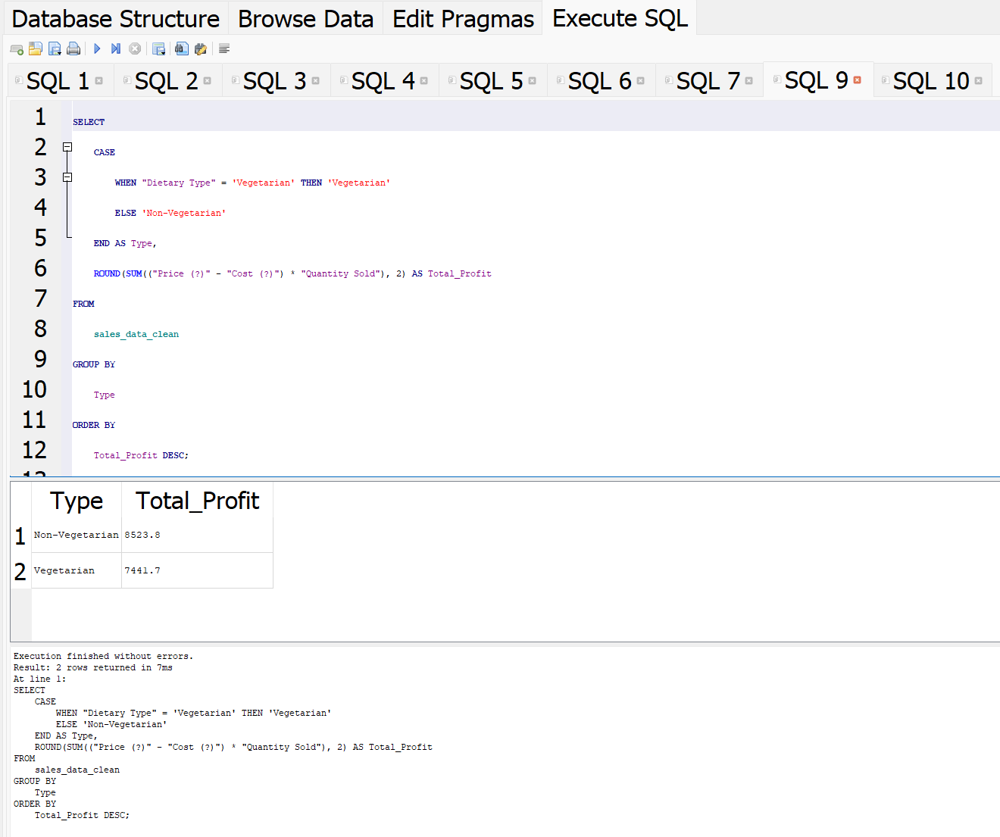
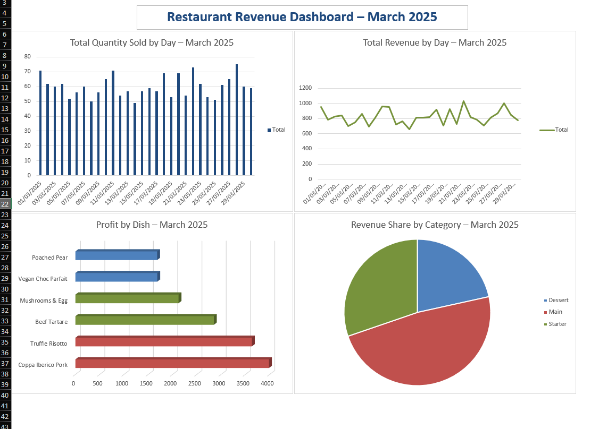

# restaurant-sales-sql-analysis

A beginner-friendly SQL project analysing restaurant sales and profit using real-world inspired data.

## 📊 Project Overview

This project simulates a real restaurant sales database, and aims to answer business questions using SQL queries and simple visualizations.

- Period: March 2025  
- Tools: **SQLite**, **DB Browser for SQLite**, **Excel**  
- Dataset: Manually created based on realistic restaurant scenarios

---

## 🔧 Objectives

1. **Understand daily sales performance**
2. **Compare lunch vs dinner revenue**
3. **Analyze dish profitability and margins**
4. **Evaluate vegetarian vs non-vegetarian performance**
5. **Generate insights by day of the week and category**

---

## 📁 Files Included

| File | Description |
|------|-------------|
| `restaurant_data.db` | SQLite database file |
| `restaurant_data.sqbpro` | DB Browser project |
| `sales_data_clean.csv` | Cleaned version of the sales dataset |
| `restaurant_sales_data.xlsx` | Excel file with dashboard |
| `*.png` | Screenshots of SQL results and dashboard |

---

## 🔍 Key Queries & Insights

### ✅ Total Revenue per Day

### ✅ Total Quantity Sold per Day

### ✅ Top 5 Most Profitable Dishes

### ✅ Average Profit Margin by Category

### ✅ Total Profit by Dietary Type

### ✅ Revenue by Shift (Lunch vs Dinner)

### ✅ Revenue by Weekday (Sorted)

### ✅ Vegetarian vs Non-Vegetarian Total Profit

---

## 📊 Excel Dashboard
The Excel file includes a dashboard with charts summarizing all key metrics:

---

## 📌 What I Learned

- Importing and cleaning CSV data into SQLite
- Writing aggregate SQL queries with `SUM()`, `GROUP BY`, `ROUND()`, `CASE`
- Comparing KPIs using logic and filtering
- Creating a clean Excel dashboard with visuals for non-technical audiences
  
## 🙌 About This Project
This is my first project as I start a new journey transitioning from hospitality to tech.

After years working as a cook in Dublin, I decided to explore a new career path focused on technology and data. I’m just getting started — learning tools like SQL, cloud services, and data analytics, and using GitHub to document my progress.

This project is the beginning of that journey. It combines my background in restaurants with new skills I’m building step by step.

I’ll keep learning, creating, and sharing everything here.
More projects are on the way! 🚀
---

## 📫 Contact

Made with ❤️ by Gustavo G.T.S.  
[LinkedIn](https://www.linkedin.com/in/gustavogts/) • [Email](mailto:gustavo.gts10@hotmail.com)

---

